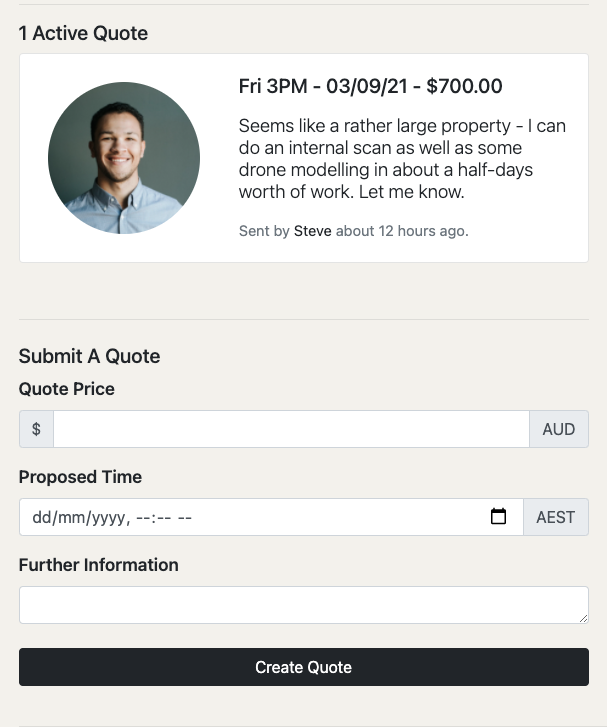

# T2A2 Marketplace Project - Orbit :rocket:

In the following README document, I will go over the 22 requirements outlined by my educators. It's not the traditional way of writing a README, however I believe it will streamline marking processes.


## R7 & R8 - Identification of the problem and reasoning behind building Orbit.

---

Welcome to Orbit, a web application intended to support tech freelancers in an ever-innovating world of Technology. As the world innovates, infrastructure, services, businesses and companies form around that innovation. In the past decade, the advancements in imaging and reality capture have made great strides and ultimately created a void due to the fact that the technology is moving faster than the rest of the world. While innovation is important, putting it to use is also greatly significant. The technologies and innovation that Orbit focuses on revolves around visualisation and reality capture, specifically digital twins and virtual reality. 

Twenty years ago, the idea of drones and robotic cameras being used in day to day business sounded like something out of a Sci-fi movie. Today, I can log in a web portal and control a drone stationed in San Francisco all the way from Brisbane, Australia! (This is an actual thing by the way, I've tried it! It really feels like something out of a video game! GTA vibes, anyone?!)

These giant leaps in innovation allow us to rethink how we can create value out of these new technologies and look for opportunities to implement them in a newly formed market. As of 2021, there seem to be many use case scenarios for drones and reality capture, but allow me to get your mind working around some unique use-cases.

"You are an insurance provider that has to handle over 200 claims of damage to property due to a hail storm in a certain suburb. How do you handle this? 
Do you send out 50 loss adjusters with ladders to climb on each roof and take photos of broken solar panels and holes in tiles? Does that seem efficient?"

"You are an interior design and architecture company that has been contracted to remodel the interior of a penthouse. To do your job effectively you need a model to understand where everything is and how big each individual thing is?
How can you efficiently do this? Is there a better way than pulling out a notepad, pencil and measuring tape?"

## R11a So how does Orbit serve this purpose?

---

These are just two examples of many, many other use case scenarios where reality capture brings real business value to current processes. Companies are already employing these technologies to do things such as remote damage assessments to telecom towers, therefore reducing their maintenance costs by a significant amount. 

Given the use case scenarios are very real, likely events, there is currently no widely adopted platforms that provide a means of access to drone pilots and reality capture technicians.

By creating a freelance platform where we can connect clients to technicians, it's no longer a matter of connections and knowing who to ask for a drone pilot, it's a simple matter of putting up a task at a desired location and waiting for them to come to you!

This is where Orbit comes in. Orbit fills the void that the fast innovation of the reality capture space has created by releasing a freelance marketplace connecting people in need of the technological advancements to enthusiasts & professionals who can fulfil those needs.

## R9 - A link (URL) to your deployed app (i.e. website)

---

As the application is hosted on Heroku's "Free Tier" You can expect a once-off wait time of around 10 seconds. 

You can find the application at:

https://visual-orbit.herokuapp.com

To log in the application, you may use the following credentials for varying levels of authority.

#### If you want to skip the signin stage, you can use the accounts below:

```
User Role: Client (Low)

User Email: clientorbit@gurumail.xyz

Password: ClientOrbit!

--

User Role: Tech (Medium)

User Email: techorbit@gurumail.xyz

Password: TechOrbit!

--

User Role: Admin (High)

User Email: adminorbit@gurumail.xyz

Password: AdminOrbit!
```


## Local Repo Install Guide

---

Ruby on Rails prerequisites apply, See [here](https://gorails.com/setup/osx/11.0-big-sur) for more info.

```
Clone the repository.

Inside your terminal, run bundle install.

Then run the following commands:

rails db:setup

rails db:migrate

rails server

Enter [http://localhost:3000/](http://localhost:3000/) in your favourite browser.
```

## R10 - Github Repo

---

You can find the public repo of the latest available build on Heroku at:

[Here.](https://github.com/flintzb/orbit)

## R11b - Functionality & Features

---

- Authentication & Spam Prevention
  Orbit allows users to register and sign in to this application through the Devise gem. Alongside registrations and logging in, devise also provides further helpful functionality such as being able to confirm a users email address and resetting your password.
  
  Alongside devise, I also used 'invisible_captcha' which renders invisible form fields that manipulate malicious parties into filling them. A real user would leave these fields empty and as such, if any of these fields are populated, the form submission is prevented. 
  
  These two features provide my application with the necessary framework to add and manage real users.

- Authorisation & Administrators
  Being able to see and manipulate what you're *supposed to see and manipulate* is a crucial aspect to any good application. Especially one such as Orbit that deals with sensitive information such as addresses and surnames. I manually defined roles and authorisations to categorise my users into three categories.
  
  Clients:
  Base level access account, cannot touch elements that belong to others, cannot submit quotes for jobs. As the name suggests, this access level is for clients and not operators/technicians.
  
  Technicians:
  If approved, clients can become technicians through the administrator. In a real world scenario, a user may request this access level because they have the skills and required know-how of operating a drone or conducting reality capture scans. This access level provides each technician with the ability to submit a quote. However, a technician may only delete or edit elements that belong to them only.
  
  
  
  Administrator:
  As suggested by the name, an admin has site level permissions, they can access quotes, edit and even delete the profiles of others. But most importantly, they can grant and revoke permissions of other users.
  
  


- Transactional Emails
  I used AWS SES to setup transactional emails before later switching to ElasticEmail. Simply put, a user will receive an email for:

    - User Registration
    - Password Reset
    - Password Change Notice
    - New quote on submitted task (*disabled for fluent testing*)

    Due to my domain not being verified, most user-emails are going to the spam folder, however this is easily fixable in the future but not a priority for this application. 

- Geocoding & Mapping
  The mapping functionality is definitely my favourite feature in the entire app. Interacting with the Google API was certainly a learning curve. 
  In orbit, geocoding & mapping comes into play when we are in the context of creating a task. In order for me to store task locations, I had to get my hands dirty with some geocoding as I didn't want to burden my users to enter latitude and longitude. 
  Therefore, I used the Google Maps JavaScript API alongside the Maps Places API to generate a dynamic "search" field. I managed to achieve this with the help of StimulusJS. Once an address is selected, the API automatically populates the latitude and longitude sections of the form which later gets validated to only accept values that place it inside Australia! This piece of functionality was really fun to add and really rewarding to see work.

- Quoting Functionality
  I really wanted to be unique in my app, therefore in my app, the sellers approach the buyers with quotes! A user may only submit a quote if they've been given prior access by an admin. The reason is that not anyone can be a drone pilot or an operator, they need to be assessed not only for their qualifications and compatibility, but also for legal reasons such as RePL licenses that allow pilots to fly drones of different weight categories.

- Validation & sanitation of ALL user input.
  As outlined in the rubric, validation and sanitisation of the application was a big focus for me.
  My approach to this problem was to list validations by categorising inputs and managing them one by one.
  In the entire application, a user will ONLY input information in one of three different scenarios.

    1. User Information
       I didn't need to worry about this very much as Devise handled most of the validations for me! 

    2. Task Information

       The most important piece of validation in the task model is the address and coordinates. As this website is intended for use in Australia, I created validations that will only **requires** a location with latitude and longitude values within Australian ranges. Therefore, you can't enter a location in New Zealand, or a location that doesn't exist or is empty.

       In order to encourage descriptiveness, I also put a character limit on the description input.

    3. Quote Information

       Similar to tasks, quotes need to be descriptive and also need to have a number as a price. These validations are handled in the model to prevent malicious misuse of the products features.

       

    ## R11c - Sitemap

  ---

  

  

    ## R11d - Screenshots

  ---

  ### Landing

  ### 

  ### Signup and Registration Pages

  

  

  ### User Pages

  

  

  

  

  

  

  ### Task Pages

  

  

  

    ## R11e - Target Audience

  ---

  As with any two sided marketplace, our target audience consists of two different types of users. A **Client** and a **Technician.**

  Clients consist of the demographic that require modelling and imaging to be done for them. This can be for multiple reasons.

  They are either: 

    - Unfamiliar with the technology but require it's benefits.
    - Familiar with the technology but don't have the necessary equipment.
    - Familiar with the technology, have the necessary equipment but don't have the time or willpower to spend doing this task.

  As such, there can be great variance in who a client can be, however one thing they all have in common is that they have an asset or area that requires scanning. 
  Within Orbit, the clients are the buyers of the digital assets that are quoted to them by different technicians. They can choose to go with whichever technician they see fit, varying by price/availability/extra services, but in the end, the client will buy the assets/services from a single technician.

  

  Technicians are the individuals who have the necessary requirements behind being an operator of drones and reality capture cameras. They are often hobbyists and enthusiasts who have gotten the necessary expertise required to offer their services at a cost. 

  Technicians are *required* to have the necessary equipment in order to carry out a specific task on Orbit. By law, they are also required to hold a RePL licence from CASA if their drone is over 250grams. 

  Given the material and legal requirements for technicians, they are required to go through a manual approval process in which the site admin will give them the necessary permissions in order to complete the task. 

  Given the requirements above, technicians are required to be over 18 years old.

  

    ## R1, R2, R3, R4, R5, R6, R11f, R16 - Tech Stack & Third Party Services

  ---

  Requirements 1 to 6 of the application refer to the tech stack behind the application and its deployment. Orbit is a web application that was built-on the popular web framework **Ruby on Rails (R1)** also using the very popular and open-source **PostgreSQL** **(R2)** as the Database Management System. Orbit was built on **Heroku (R6)** using CI/CD principles through a connection with the repository on Github. 

    **(R16) CMP1042-1.3 Detail any third party services that your app will use:**

    Orbit uses many gems and third-party services to add features such as: 

    - [invisible_captcha](https://github.com/markets/invisible_captcha) - A gem used to prevent bots and malicious users to register for the site. This gem alongside Devise's :confirmable feature through AWS SES allows me to ensure the validity of the users that sign up to my app.

    - [Devise](https://github.com/heartcombo/devise) - **Authentication (R3),** I initially created an entire user model from scratch and in doing so, learnt a lot about the manual sign in and out process of a rails application, alongside important concepts such as the sessions controller. However, I later learnt that in application, Devise not only uses better, more complete, methods of authentication, but also speeds of the development speed of the programmer.

      With Devise, I was able to:

      - Create A Login System
      - Create A Registration System
      - Confirm Email Addresses
      - Reset Passwords
      - Resend Confirmation Emails.
      - Edit Registration Attributes of an existing user.

    - Active Storage & Amazon S3 - **File Uploading (R5),** I used this to enable user avatars, which were a great addition to the look and feel of the application.

  Due to the complex nature of the application, I handled **authorisation (R4)** manually and not through a third party gem or API.

  Speaking of API's, as outlined by the rubric, I also met four additional **optional** requirements.

  I used 4 different API's to handle geocoding and map functionality. **(O2)** - This was a fantastic learning opportunity for me and I will definitely take these skills with me to my next job.

    - Google Maps Static API: For static map generation: I used this API in order to generate maps that don't slow a specific page down. For example, the tasks#index page lists all available tasks with a map. If I included an interactive map for each one, my site would become incredibly taxing to use.
    - I used Google Maps Embed API to host mobile friendly interactive maps on task pages, allowing the technicians to move around, view where the required task is and even get directions to the task.
    - I used Google Maps Places API + Google Maps JavaScript API alongside some JavaScript code using StimulusJS to ease the process of creating new tasks through live geocoding and address suggestions, therefore creating a pleasant user experience.

  I also successfully used AWS SES to handle transactional emails **(O3).** However I later successfully swapped this over to [ElasticEmail](https://elasticemail.com/) due to sandbox limits AWS placed on my AWS account as a new, suspicious user! I submitted an increase request to support, however they denied it. Luckily, ElasticEmail was just as easy to use, if not easier.

  The app also allows for internal messaging **(05)** between client and technician through the quotes model. This was hand-built by me and is an integral feature to the use of the application. 

  As for a searching, sorting and/or filtering capability **(04)**, I used rails lambda methods to elegantly sort however I wanted information to be pulled, upon reflection, I could've added many other ways as well.

  The front-end of the application was managed through HTML, Bootstrap & Sass with a little bit of JavaScript, however as this wasn't a marked area of this assignment, **the frontend of the application was not a priority.** 

  

  ## R12 - User Stories

  ---

  As there are only two different types of users that Orbit caters for, our user stories are split up into the following two sections. 

  **As a Client I:**

  - Want to find someone with the necessary expertise in order to scan my asset so that I can use the digital asset for design/construction/insurance/documentation purposes in an efficient manner

  - Want this scan to occur at a time that works for me so I don't need to reschedule valuable time out of my busy day.

  - Want this scan to happen for a price that is reasonable to me, so I feel like I am getting the appropriate amount of value for the money that I am spending.

  - Want to be able to view different quotes sent to me so that I am considering all my options.

  - Want to be able to reject quotes in case I definitely can not accept their offer.

  - Don't want to see quotes sent by bots or spam accounts so I know that I'm always speaking with a real person.

    

  **As a Technician I :**

  - Want to monetise my hobby and find people who require my services so that I can earn money doing something fun at times that are suitable to me.

  - Want to be able to see further information about any given task so that I can make an educated decision on whether or not I am the right person for the job.

  - Want to see *where* a job is so the I can do jobs that are convenient to me.

  - Want to see *who* posted the job so I can contact them.

  - Want to send quotes in to whichever jobs I choose.

  - Want to be able to edit my quotes in case I made a mistake.

  - Want to be able to delete my quotes in case I no longer can do them.

  - Don't want to see jobs posted by bots and spam accounts so I know that I'm always speaking to a real person.

    

  ## R13 - Wireframes

  ---

  When I first started this project, my wireframes looked like this:

  

  The image is in high resolution so I won't post all screens on here, but I wanted to point out how since then my wireframes have changed.

  Given the small time frame and the expedited nature of my project, I further simplified the wireframes. I reduced complexity by using flash alerts and partials. I also changed the layout from horizontal to vertical to ease design concerns. The new wireframes are linked below: 

  ### Landing 

  

  

  ### Registration

  

  

  ### Sign In

  

  

  ### User Index

  

  

  ### User Show Profile

  

  

  ### Task Index

  

  

  ### Task New

  

  

  ### Task Show

  

  

  ## R14 - Entity Relationship Design

  ---

  This was the initial ERD design I sent in, however a great deal has changed since. 

  

  This old design of the ERD included entities like Pilot, Service and "Scan".

  Since then, the design has been refined to a further elegant solution.

  

  You can find a live version of this ERD [Here](https://dbdiagram.io/d/6126720c6dc2bb6073bb51da).

  

  As the project progressed, I realised that I can come up with a more elegant solution for the old model, **Pilots**, so I found a way to incorporate the functionality I wanted inside the users table without adding too many fields. 

  I also replaced the street/suburb/etc fields with a simple latitude and longitude. This enabled me to not only simplify validation, but also to reduce the potential amount of columns without losing out on the functionality I wanted as the Google Maps API returns all of those same elements inside a hash anyway. 

  I also came to the conclusion that the previous ERD was not as well thought out with key elements missing such as descriptions of tasks, quote contents and prices and even key elements such as date of post.

  

  ## R15 - Explain the different high-level components in your app.

  ---

  Similar to most rails applications, the application is built on a Model-View-Controller architecture, and as such the app operates through the delegation of responsibilities to seperate components of the application. In the following sections, we will dive into these components and how they operate within Orbit.

  Simplified, The router is responsible for sending recieving requests and sending them to the appropriate controller. Subsequently, depending on the desired action of the user, the controller will render an appropriate view with information generated from the appropriate model.

  

  #### Models

  The application holds three different types of models: 

  * User
  * Task
  * Quote

  Each of these models are responsible for the business logic of that specific entity and contains information about how that entity is managed throughtout the application. The models contain functions, vaildations and even database queries that are ready to be called as needed by the controller. The interactive and consistent use of the model is what differentiates Orbit from a static website. 

  However it is important to note that the model does not execute these functions <u>unless</u> called upon to do so via the controller. 

  

  #### Controllers

  Fitting for its name, Controllers control the flow of the application. They recieve input and convert it to commands for the model and view. Controllers manage how data is displayed in the application by pulling, modifying and providing relevant data to the user. 

  Not dissimilar to a waiter at a restaurant, the controller is the link between the view and model.

  In Orbit, I have made 4 seperate controllers, each designated to handle a certain resource. 

  - User Controller
  - Task Controller
  - Quote Controller
  - Static Pages Controller

  Each controller handles how the application should respond in the event of a certain request being made. For example, Within the **task** controller, we can define what happens when a user clicks on a **create task** button (from the view). 

  

  The application uses the above code to generate the "new" template in our views and waits for a response.

  In the case of Orbit, we wait for a "create" action to be triggered in the view, which will then be handled by our controller and sent over to the model "task.rb"

  

  

  #### View

  In my opinion, the view is the easiest component to understand within the application. Understandably named, it is what the user see's at any given stage in the application. Views responsibility is to manage what you see on your screen. The syntax is an **erb.html** file, which allows for us to insert lines of ruby code within a html document. 

  This allows us to display interactive data in our own predefined conditions.

  

  For example, the above snipped of code, only displays the path to edit your profile if you are the owner of the profile page in question.

  

  ## R17 & R18 - Orbit Models, Active Record Relations and  Database Relations

  ---

  Orbit has 3 main models:

  - User
  - Task
  - Quote

  ### User Model

  The user model is a representation of all potential users of the application. All business logic for these users such as how to determine roles and age are stored inside the user model.

  **Attributes:**

  * id (primary key)
  * birthday
  * roles
  * first_name
  * last_name

  Due to devise, the user entity is the largest one in the application, with many supportive attributes such as:

  * email
  * encrypted_password

  * confirmed_at
  * reset_password_token
  * encrypted_password
  * and more..

  I decided against using a seperate user_info table as outside of devise, I do not have many custom attributes.

  **Active Record & Database Relations:** 

  * **has_many** :tasks

    A one to many relationship that sets up an association with the tasks model.

  * **has_many** :quotes

    A one-to-many relationship that sets up an association with the quotes model.

    The following picture demonstrates the relationship between users, quotes and models. Showing that quotes and tasks **belongs_to** users while users **has many** quotes and tasks. 

    

    

  * **One Attached** avatar. (If not, default avatar will be used.) - This is a one-to-one relationship as each user can only have one avatar, and each avatar only has one user. 

  * **Validations** are done by Devise. Except: validate :acceptable_image -> Custom Validation for an acceptable avatar image.

  

  ### Task Model

  The task model represents all the available jobs/listings within the application. The attributes tracked within this entity are listed below.

  **Attributes:**

  * id (auto incremented, primary key)

  * address [semi-new]
  * latitude [new]
  * longitude [new]
  * description [new]
  * user_id (foreign key, reference to users)
  * created_at (added by rails)
  * updated_at (added by rails)

  Compared to the original ERD, this model contains more information such as latitude and longitude, which are generated by Google's Geocoding API through Geocoder dependent on the user input. 

  **Active Record & Database Relations:** 

  * **belongs_to** :user (many-to-one), sets up a connection between the user and the task.

    A relationship that sets up an association with the tasks model. In other words, a task can only have one owner (user), but a user can own many tasks. 

  * **has_many** :quotes (one-to-many)

    A one to many relationship that sets up an association with the quotes model. In other words, a task can have many quotes. 

  **Validations**:

  * **Validates** :description, address, latitude, longitude.

    The following picture demonstrates the relationship between **Tasks** and **Quotes**:

    

    

  ### Quote Model

  The quote model is the representation of all quotes submitted by eligible technicians. Non-technicians do not have access to this model as discussed above, unless they are the owner of the task. 

  **Attributes:**

  * Price
  * Booking
  * Content
  * user_id
  * task_id
  * created_at (added by rails)
  * updated_at (added by rails)

  This model replaced the scan model of the previous ERD. Why? Because I wanted to give my potential users the ability to choose between different quotes. In future versions of the application, I would like to complete the order process by allowing users to follow through on the quote by adding Stripe integration for payment and a delivery system using transactional emails and a deliverables page. 

  **Active Record & Database Relations:** 

  * **Belongs_to** :user, sets up a connection between the user and the quote.
  * **Belongs_to** :task, sets up a connection between the task and the quote.

  **Validations**

  * **Validates** :content, :price and :booking.

    

  ## Schema Design

```ruby
# This file is auto-generated from the current state of the database. Instead
# of editing this file, please use the migrations feature of Active Record to
# incrementally modify your database, and then regenerate this schema definition.
#
# This file is the source Rails uses to define your schema when running `bin/rails
# db:schema:load`. When creating a new database, `bin/rails db:schema:load` tends to
# be faster and is potentially less error prone than running all of your
# migrations from scratch. Old migrations may fail to apply correctly if those
# migrations use external dependencies or application code.
#
# It's strongly recommended that you check this file into your version control system.

ActiveRecord::Schema.define(version: 2021_08_24_005753) do

  # These are extensions that must be enabled in order to support this database
  enable_extension "plpgsql"

  create_table "active_storage_attachments", force: :cascade do |t|
    t.string "name", null: false
    t.string "record_type", null: false
    t.bigint "record_id", null: false
    t.bigint "blob_id", null: false
    t.datetime "created_at", null: false
    t.index ["blob_id"], name: "index_active_storage_attachments_on_blob_id"
    t.index ["record_type", "record_id", "name", "blob_id"], name: "index_active_storage_attachments_uniqueness", unique: true
  end

  create_table "active_storage_blobs", force: :cascade do |t|
    t.string "key", null: false
    t.string "filename", null: false
    t.string "content_type"
    t.text "metadata"
    t.string "service_name", null: false
    t.bigint "byte_size", null: false
    t.string "checksum", null: false
    t.datetime "created_at", null: false
    t.index ["key"], name: "index_active_storage_blobs_on_key", unique: true
  end

  create_table "active_storage_variant_records", force: :cascade do |t|
    t.bigint "blob_id", null: false
    t.string "variation_digest", null: false
    t.index ["blob_id", "variation_digest"], name: "index_active_storage_variant_records_uniqueness", unique: true
  end

  create_table "quotes", force: :cascade do |t|
    t.float "price"
    t.string "content"
    t.datetime "booking"
    t.bigint "task_id", null: false
    t.bigint "user_id", null: false
    t.datetime "created_at", precision: 6, null: false
    t.datetime "updated_at", precision: 6, null: false
    t.index ["task_id"], name: "index_quotes_on_task_id"
    t.index ["user_id"], name: "index_quotes_on_user_id"
  end

  create_table "tasks", force: :cascade do |t|
    t.string "address"
    t.string "latitude"
    t.string "longitude"
    t.string "description"
    t.datetime "created_at", precision: 6, null: false
    t.datetime "updated_at", precision: 6, null: false
    t.bigint "user_id", null: false
    t.index ["user_id"], name: "index_tasks_on_user_id"
  end

  create_table "users", force: :cascade do |t|
    t.string "email", default: "", null: false
    t.string "encrypted_password", default: "", null: false
    t.string "reset_password_token"
    t.datetime "reset_password_sent_at"
    t.datetime "remember_created_at"
    t.string "confirmation_token"
    t.datetime "confirmed_at"
    t.datetime "confirmation_sent_at"
    t.string "unconfirmed_email"
    t.datetime "created_at", precision: 6, null: false
    t.datetime "updated_at", precision: 6, null: false
    t.string "first_name"
    t.string "last_name"
    t.date "birthday"
    t.jsonb "roles", default: {}, null: false
    t.index ["confirmation_token"], name: "index_users_on_confirmation_token", unique: true
    t.index ["email"], name: "index_users_on_email", unique: true
    t.index ["reset_password_token"], name: "index_users_on_reset_password_token", unique: true
    t.index ["roles"], name: "index_users_on_roles", using: :gin
  end

  add_foreign_key "active_storage_attachments", "active_storage_blobs", column: "blob_id"
  add_foreign_key "active_storage_variant_records", "active_storage_blobs", column: "blob_id"
  add_foreign_key "quotes", "tasks"
  add_foreign_key "quotes", "users"
  add_foreign_key "tasks", "users"
end

```


## Version Control

---

To ensure safe development, I initally used Git with Sourcetree and Bitbucket as an opportunity to gain more experience using different services. While there weren't any real issues, I chose to switch over to GitHub in order to make use of a CI/CD deployment pipeline to Heroku.

I had initially made a completely different application to start with, so my total commit count for a project of this size was actually not that much. I think I finished the project with just around 60 commits. This was due to my better experience the second time round, allowing me to make less mistakes.

All git commits have descriptive comments and have been added to a gitlog.txt file. 


## Task Allocation With Trello

---

You can see my live trello board application [here](https://trello.com/b/I7RYI7yc/rails-marketplace-application).


I used trello to seperate my tasks like a checklist, each card contains information regarding the requirements of the application as set out by my educators with further information inside. I used dates and labels to categorise tasks and put them in larger categories such as slide deck, documentation and application development.

This was much more readable for me as I could directly see the information as it relates to the rubric and plan my approach from there.
